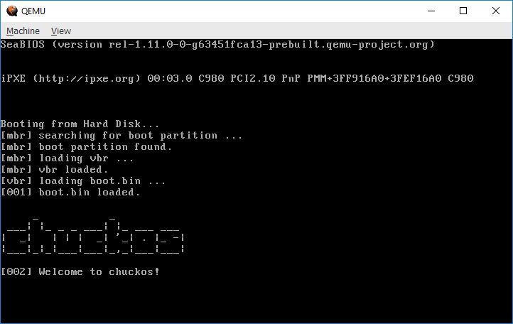

# chuckos

A toy IA-32 operating system with a custom boot loader (which loads the kernel from a fat16 partition).

#### Compile

Use your preferable assembler and compiler.

The build script uses [nasm](http://www.nasm.us/) for the assembly sources and [tcc](https://bellard.org/tcc/) for the c sources.

#### Link

Use your preferable linker.

The build script uses the [Open Watcom](http://www.openwatcom.org/) linker.

#### Install

The boot loader loads the kernel (and some more boot code) from the root directory of a fat16 partition, so you'll need to format your media as fat16 (make sure there are at least 2 reserved sectors for the VBR).

Write **mbr.bin** (you can use dd for that) to the first sector, make sure you don't overwrite the partition table - you only need the first 436 bootstrap bytes and the last 2 boot signature bytes (which are probably already there):

Bootstrap code:

`dd if=bin/mbr.bin of=... bs=1 count=436 conv=notrunc`

Signature:

`dd if=bin/mbr.bin of=... seek=510 bs=1 skip=510 count=2 conv=notrunc`

Write **vbr.bin** to the fat16 partition first two reserved sectors, again, you don't want to overwrite your partition BPB data, so make sure you only copy the first 3 bytes (short jmp to boot code) and the last 450 bytes (code and signature) of the first sector. For the second sector, just copy the entire 512 bytes, no worries here.

The final part is to copy both **boot.bin** and **kernel.bin** to the root directory of the partition.

#### build.cmd

You can use this script under Windows. It'll compile, link and install chuckos to a pre-formatted 128M raw hard drive image. It requires the following tools:

1. [nasm](http://www.nasm.us/)
2. [tcc](https://bellard.org/tcc/)
3. [wlink](http://www.openwatcom.org/) (Open Watcom linker)
4. [dd](http://www.chrysocome.net/dd) (that's a dd for Windows)
5. [imdisk](http://imdisk.en.lo4d.com/) (used for mounting the image for copying boot.bin and kernel.bin)

You can change the scripts to work with any other compatible tools (gcc, ld, etc.).

Make sure you extract the image (disk_formatted_128m.img) from empty_images.zip before you run the script.

#### Run

You can use a real machine or any x86 emulator (vmware, boches, qemu, etc.).

Make sure to have at least 1gb of RAM.

#### TODO

- Heap allocations.
- stdin, stdout.
- Page fault handler.
- IRQ 0x21 handler (keyboard).
- Multitasking.
- All sort of system calls.
- Console.
- GUI.
- ...